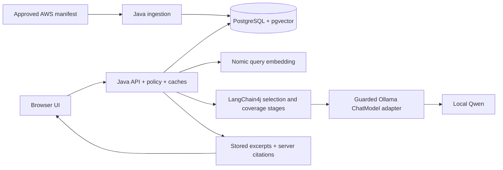

# AWS Tech Support Agent

A local Java RAG application that answers AWS questions using downloaded documentation and cited excerpts. No AWS credentials or paid model API are required.

**Implemented local demo; production release gates remain pending.** See [verification status](docs/implementation-status.md).

Stack: Java 21, Spring Boot, **LangChain4j core 1.19.0**, PostgreSQL/pgvector, Caffeine, and local Ollama running Qwen3 4B plus Nomic Embed Text v1.5. The browser UI is plain HTML/CSS/JavaScript served by Java.

The architecture is not specific to Mac M1 Pro. That 16 GB machine is our tested reference host; see [platform setup](docs/platform-setup.md) for Linux, macOS and Windows/WSL2 guidance and validation limits.

## Architecture



The full seed manifest contains 120 official pages: IAM 20, S3 25, EC2 25, VPC 20, Lambda 15, CloudWatch 15. The reference snapshot has 1,330 passages. Models, downloaded documentation and database files are not bundled with source.

## Run on the already provisioned reference machine

Docker Desktop failed on that host, so it uses isolated native PostgreSQL. Choose one database path; never start both on port 54329.

```sh
./scripts/postgres-native start
# Or, on a healthy Docker installation: docker compose up -d --wait postgres

# Separate terminal, if Ollama is not already running:
./scripts/ollama serve

# Build after code or prompt changes; then run Java in another terminal:
./scripts/maven package
./scripts/run serve
```

Open **http://127.0.0.1:8080/**. Avoid duplicate application instances. Stop the Java/Ollama server terminals with Ctrl-C. Ollama terminal chat's `/bye` only exits its chat client.

## Fresh setup

Install Java 21, Maven 3.9.11 (or use `./mvnw`), Python 3.11+, a compatible Ollama runtime and Docker Compose or native PostgreSQL with pgvector. Plan at least 10 GB free disk initially. Detailed platform steps are in [platform-setup.md](docs/platform-setup.md).

On **macOS ARM64 only**, the optional `python3 scripts/bootstrap.py` installs checksum-pinned project-local Java/Maven. Other hosts provision those tools independently.

```sh
./scripts/configure-local
python3 scripts/setup-models.py
# Downloads pinned tokenizers; also installs the macOS Ollama archive on macOS.
# Other hosts must separately install the Ollama version in config/models.lock.json.
docker compose up -d --wait postgres
```

macOS fallback when Docker is unavailable:

```sh
python3 scripts/setup-postgres.py
./scripts/postgres-native start
```

Start `./scripts/ollama serve` separately, then:

```sh
./scripts/ollama pull nomic-embed-text:v1.5
./scripts/ollama pull qwen3:4b
./scripts/maven package
./scripts/run validate-manifest
./scripts/run ingest
./scripts/run serve
```

The application validates [pinned model/tokenizer identities](config/models.lock.json). Changed upstream tags require a reviewed profile update, not bypassing validation. Use host-native Ollama for macOS Metal acceleration. Native Windows operational scripts are not supplied; WSL2 is a documented, untested target.

## Prompt chain and grounding

On the normal uncached path, Java embeds the question, retrieves local passages and asks Qwen to select evidence IDs. Java validates those IDs before a second Qwen coverage check. It renders complete stored excerpts with server-built citations; **model-written AWS prose is never displayed**.

LangChain4j handles packaged templates and structured model calls through our guarded adapter. We retain explicit policy, deadlines, token parity, inference locks and uncertain-completion quarantine. There are no automatic agents, tools, chat memory, output-repair loops, cloud fallback or query-time web browsing. See [how to add a prompt stage](docs/prompt-chains.md).

Missing/rejected evidence returns **“Information is not available in the local documentation.”** Clarification and operational errors remain distinct. Similarity, schema validity and the same-model second check do not prove correctness; excerpts can still be irrelevant, incomplete or stale. Synthesized prose remains disabled pending separate evaluation.

Prompt resources are under `src/main/resources/prompts`. Their digest participates in answer-cache identity. Prompt-only changes need a rebuild/restart and evaluation, **not** re-embedding. Changes to the embedding/tokenizer/extraction profile require compatible re-ingestion.

## Code map

| Path / class | Purpose |
| --- | --- |
| `AwsSupportApplication.main()` | Spring Boot startup |
| `adapters/inbound/ChatController` | REST entry point: POST `/api/v1/chat` |
| `application/AnswerQuestion` | Retrieval/cache/validation/rendering policy |
| `adapters/outbound/EvidencePromptChain`, `PromptStage` | LangChain4j prompt stages |
| `adapters/outbound/OllamaModel` | Guarded local HTTP transport and ChatModel bridge |
| `adapters/outbound/PostgresCorpusRepository` | Hybrid retrieval and atomic publication |
| `src/main/resources/static` | UI HTML, CSS and JavaScript |
| `src/main/resources/prompts` | Packaged prompt templates |
| `AGENTS.md` | Coding-agent guidance; not an application runtime dependency |

All Java packages are under `src/main/java/com/acme/awssupport`. Classes have Javadoc; see [low-level diagrams](docs/low-level-design.md) for relationships and sequences.

## Refresh, storage and caches

```sh
./scripts/run refresh
./scripts/run status
# Opt-in daily refresh while Java runs:
RAG_REFRESH_ENABLED=true ./scripts/run serve
```

Review manifest changes, validate, then refresh. All entries are required. Snapshots are content-addressed; compatible embedding checkpoints survive failed jobs. Publication is atomic. Unchanged refreshes retain the generation, and failed refreshes retain the previous corpus. Scheduling does not wake a sleeping host. Automatic pruning is not implemented.

Caffeine stores bounded exact answers, embeddings and retrieval candidates. **Similar-query cache hits never directly replay an old answer.** Generation, model/prompt/policy, filters and history scope answer reuse, with authoritative revocation checks before returning results. Caches disappear on restart.

Native reference-host storage: `.tools/` contains runtimes; `data/models` contains weights; `data/postgres` contains native database files; `data/snapshots` contains HTML. Docker PostgreSQL uses its own named volume instead. Connection defaults are `127.0.0.1:54329`, database/user `aws_support`, password from ignored `.env`.

## Verification

```sh
./scripts/maven test
# Includes Testcontainers integration tests; Docker required:
./scripts/maven spotless:check verify
# Existing native PostgreSQL alternative:
set -a
. ./.env
set +a
RAG_TEST_DB_URL=jdbc:postgresql://127.0.0.1:54329/aws_support ./scripts/maven spotless:check verify
# Real-model probes against the updated running app:
python3 scripts/smoke.py
```

Tests use isolated schemas without clearing the corpus. Unit tests need no model weights; model-contract tests bind local HTTP stubs. The smoke probes are development checks, not the independently reviewed 200-case acceptance benchmark. See [recorded results and limitations](docs/implementation-status.md).

## Specifications and operations

- [Requirements](docs/requirements.md) and [architecture decisions](docs/decisions.md)
- [High-level design](docs/design.md) and [low-level design](docs/low-level-design.md)
- [Prompt-chain extension guide](docs/prompt-chains.md) and [platform setup](docs/platform-setup.md)
- [Data lifecycle](docs/data-lifecycle.md), [acceptance criteria](docs/acceptance.md), [API contract](docs/openapi.yaml)
- [Operations and recovery](docs/operations.md), [recorded end-to-end example](docs/rag-example-walkthrough.md), [verification status](docs/implementation-status.md)
- [Repository guidance for coding agents](AGENTS.md)
- [Contribution and required-review policy](CONTRIBUTING.md)

Do not expose the local profile to a LAN/internet. It has browser protections, not company identity, tenant isolation, TLS, HA or a completed security audit. Readiness: `/actuator/health/readiness`; metrics: `/actuator/metrics`. Prompts, document bodies and credentials are not logged by default.
