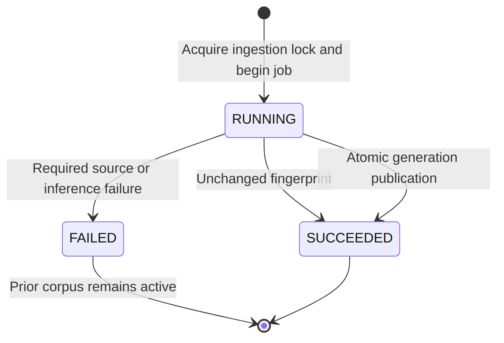

# Corpus, preprocessing and refresh

Baseline 0.3 · 2026-08-31. Implements B-02/B-03/B-04/B-09/B-15/B-16/B-17. The pipeline is platform-neutral; [platform setup](platform-setup.md) records the reference machine and pending validation.

## Corpus scope

The full seed manifest contains 120 distinct official AWS HTML pages. That count is a chosen demo scope, not a guarantee that every service question is answerable. Add curated sources for demonstrated coverage gaps instead of padding the count.

| Service | Pages | Focus |
| --- | ---: | --- |
| IAM | 20 | Policies, roles, trust, access-denied troubleshooting |
| S3 | 25 | Permissions, ownership, encryption, lifecycle |
| EC2 | 25 | Connectivity, instance state, keys, EBS |
| VPC | 20 | Security groups, ACLs, routes, gateways, endpoints |
| Lambda | 15 | Timeout, concurrency, roles, logs, invocation issues |
| CloudWatch | 15 | Logs, metrics, alarms, permissions |

`config/sources-small.json` retains the earlier 30-page IAM/S3/EC2 slice; `sources-smoke.json` is a minimal fixture manifest. All entries in a chosen manifest are required. The current full snapshot has 1,330 chunks; the configured 20,000-chunk ceiling is not a target. PDF/OCR, arbitrary uploads and recursive crawling remain excluded.

## Three representations

| Representation | Storage and purpose |
| --- | --- |
| Raw source bytes | `data/snapshots/<sha256>.html`, immutable audit/reprocessing input |
| Canonical evidence | `chunk.content`, structural text copied into citations and answers |
| Derived retrieval input | `chunk.embedding_input`, 768-dimensional embedding and lexical fields |

Raw snapshots, source metadata and derived text are separate. A citation points to a whole chunk with heading/anchor provenance; there is no independent evidence-span/offset table. This limits excerpt granularity and does not prove that qualifications spanning multiple chunks are retained.

## Fetching and extraction

A manifest entry specifies source ID, service, canonical URL and optional localFile. Sources must be HTTPS HTML on `docs.aws.amazon.com`, with no encoded paths, credentials, query strings or fragments. All redirects are rejected. DNS local/link-local/private results are rejected; response bodies are capped at 5 MiB. Downloads are sequential, with up to three attempts for 429/5xx and bounded backoff. Inference errors are not automatically retried.

Conditional requests prefer ETag, then Last-Modified. A 304 reuses a local snapshot only after checksum validation. Approved local imports resolve beneath `data/imports`; they still retain the approved canonical URL, but operator-supplied bytes are not authenticated by that URL.

jsoup extracts main content/title, checks canonical identity and removes identified navigation/script/style noise. Prose normalizes line endings, Unicode NFC and presentation whitespace. Code preserves case, punctuation and indentation with line-ending normalization. Lists split at items/explicit child blocks; table rows repeat headers. Unexpected/empty content fails visibly.

User questions normalize only outer whitespace and line endings. Case, punctuation, AWS identifiers and negation remain intact. Prior questions are joined before the current question for retrieval, but never treated as source evidence.

## Embedding and tokenization

Nomic Embed Text v1.5 produces 768-dimensional vectors through Ollama. Document inputs are `search_document: <title>\n<heading>\n<text>`; query inputs are `search_query: <retrieval text>`. No manual lowercasing, stemming, punctuation stripping or dimension slicing changes neural inputs.

DJL loads pinned local Nomic and Qwen tokenizers. Nomic counts include model special tokens; Qwen counts the complete raw ChatML prompt. Native tokenizer binaries must match the host platform. Missing artifacts or mismatched runtime token counts fail closed.

The chunker targets about 350 body tokens and may overlap a trailing non-code block of at most 50 tokens within the same heading. Structural blocks exceeding the checked 1,900-token input allowance are rejected; final prefixed chunks must fit 2,000 embedding tokens. Calls use `truncate=false`. These boundaries reduce accidental truncation but are not a universal semantic-completeness guarantee.

Lexical search is a separate representation. The current retrieval version uses English stemming/stop-word handling with a disjunctive query and exact identifier matches. Generic acronyms do not receive identifier boosts. Canonical citation text is not modified by lexical analysis.

## Profile and update matrix

The embedding profile includes pinned model/tokenizer identities and extraction/chunking/dimension versions. Reuse requires the complete embedding-input hash plus that profile. Answer identity additionally includes Qwen, policy and the LangChain4j stage/template digest.

| Change | Work required |
| --- | --- |
| HTTP 304 / unchanged meaningful corpus | Verify content; reuse embeddings; advance freshness without changing generation |
| Navigation/layout-only changes | Preserve raw bytes; re-extract; reuse identical embedding inputs |
| Changed text/title/heading | Rebuild affected inputs and provenance; publish a coherent new generation |
| Added/removed manifest source | Process complete manifest; additions/removals take effect at atomic publication |
| Failed fetch/parse/embedding | Mark job failed; preserve previous active corpus and completed checkpoints |
| Embedding/tokenizer/extraction change | Re-ingest using a compatible new profile; rerun retrieval/quality evaluation |
| Prompt-only/LangChain4j stage change | Rebuild/restart Java; answer identity changes; no embedding rebuild required |
| Urgent source revocation | Persist revocation and advance epoch immediately, including for cached responses |

## Job state and atomic publication

These are ingestion-job states, not corpus-generation states. Documents/chunks are staged in Java, while snapshots and embedding checkpoints are durable. Publication locks the active-pointer row and inserts a READY generation, its rows and the pointer in one transaction. A failed transaction leaves the old generation active. There is no persisted BUILDING/VALIDATING generation, lease-fencing protocol or automatic pre-publication real-model smoke gate in this implementation. Operators run validation and smoke checks explicitly.

Queries pin a generation. Ordinary publication allows already-running requests to use retained evidence; revocation or rollback changes the policy epoch so invalidated evidence cannot be served. Rollback requires a retained compatible generation and never undoes revocation.

## Scheduling, freshness and retention

`refresh` is explicit; scheduled refresh is opt-in with `RAG_REFRESH_ENABLED=true`. While running, Java checks every minute for the default 24-hour interval. Ingestion rechecks due time under the session advisory lock so missed intervals coalesce. Failure records a 15-minute retry gate; database outages also retain an in-process backoff. There is no OS wake-up task or strict chat-priority preemption.

The UI/API show snapshot publication, last complete successful check, corpus counts, stale state and last refresh error. Per-source attempts/verification remain in `source_check`; document fetchedAt is retained when raw bytes are unchanged. Source publication time is not inferred. The seven-day stale warning is currently fixed in repository code, not separately configurable.

Generations, snapshots and checkpoints are retained; automatic garbage collection is not implemented. Monitor disk growth and preserve referenced snapshots during backup. A local backup alone does not protect against host loss. Follow [operations](operations.md) for restore into a separate empty database and subsequent checks.

Known gaps include source review, broad layout/qualifier coverage, full offline network audit, load/latency testing, and the 200-case human-reviewed evaluation in [acceptance](acceptance.md). LangChain4j changes neither corpus ownership nor those obligations.
