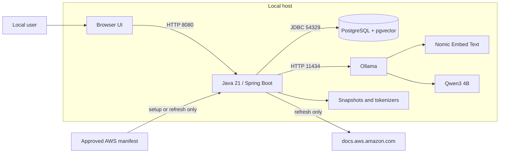
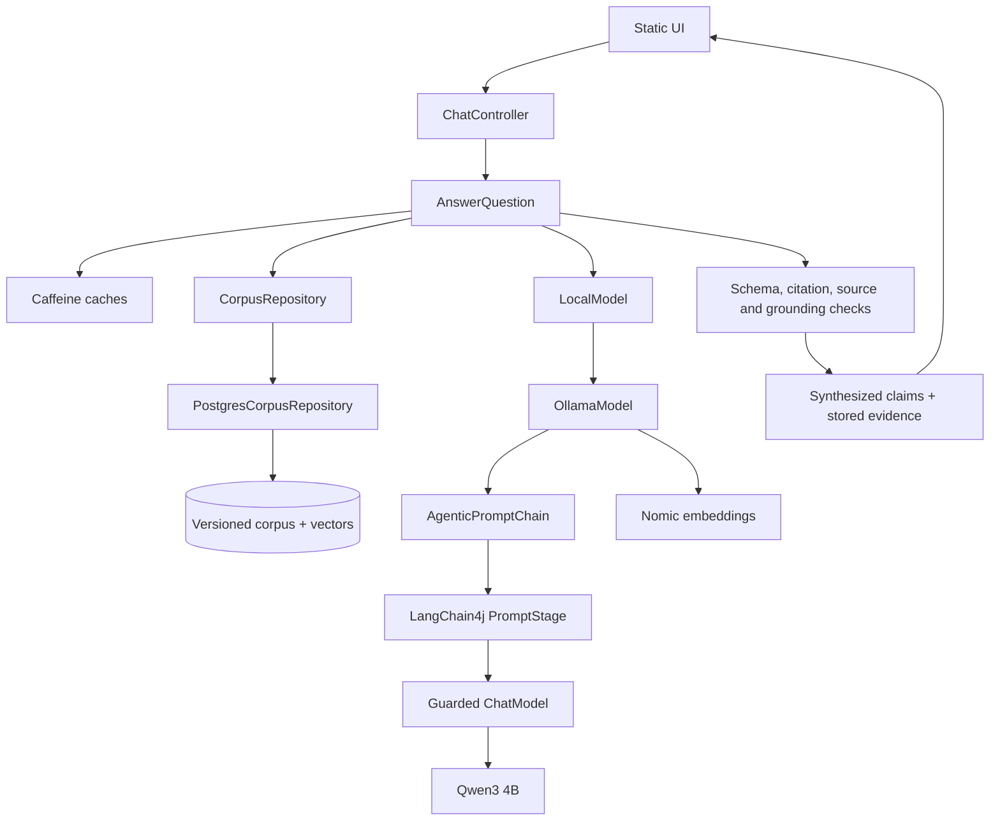
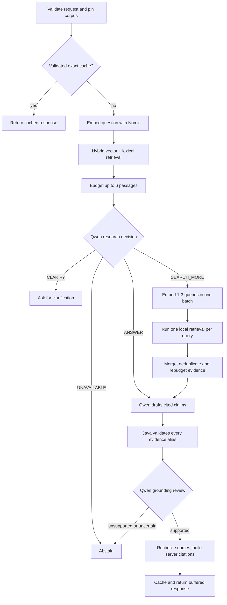
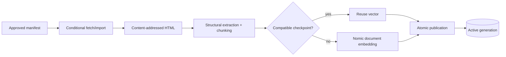

# High-level design: AWS Tech Support Agent

Baseline 0.4 · 2026-08-31 · User-authorized bounded Agentic RAG.

This is a local documentation assistant. It does not inspect an AWS account, execute commands, call AWS APIs, or search the web while answering. Java owns all execution limits and validation; Qwen may choose only among reviewed decisions and local search queries.

## System context

All listeners bind to loopback. The browser never calls Ollama or PostgreSQL. Answer requests use only the published local corpus. Mac ARM64 with 16 GB RAM is the tested reference host, not an architectural restriction.

## Application components

LangChain4j core supplies prompt templates, request objects, response schemas, and an extensible stage abstraction. It does not run an automatic agent. `AnswerQuestion` explicitly orders every stage; `OllamaModel` preserves the bounded raw Ollama transport, token checks, shared deadline, inference lock, and uncertain-completion quarantine.

## Bounded answer workflow

The search branch can run only once and accepts at most three query strings. The model cannot request another planning step after search. Java applies the user's explicit service filter to every query and executes only the existing local repository method. Follow-up embeddings are batched, and all work shares the original 60-second deadline.

A normal answered miss uses one Nomic call and three Qwen calls: research decision, answer draft, and grounding review. `SEARCH_MORE` adds one batched Nomic call and up to three database searches, but no extra Qwen planning loop. Exact answer hits skip inference. Failures do not trigger automatic repair or model retries.

## Grounding contract

- The answer stage receives only the user question and budgeted evidence text with temporary aliases such as `E1`.
- Each of at most six claims must cite one to three supplied aliases. Unknown, duplicate, empty, or uncited claims are rejected.
- The grounding stage receives only the draft and the passages that draft cites. `UNSUPPORTED` or `UNCERTAIN` rejects the complete answer.
- Java maps aliases to stored chunk IDs, rechecks the active corpus and revocation epoch, and creates citation IDs and approved `docs.aws.amazon.com` URLs.
- The UI shows synthesized claims and the exact stored citation quote separately.
- No unchecked token is streamed or cached. Missing or uncertain evidence returns “Information is not available in the local documentation.”

These controls reduce unsupported output; they cannot guarantee zero hallucinations. Qwen performs both generation and review, and the local corpus can be incomplete or stale. Production acceptance therefore includes human-reviewed grounding and adversarial cases.

## Caching and context

Exact responses are scoped by normalized question, up to three previous user questions, filters, corpus generation, policy epoch, model identities, and prompt digest. Similar-query entries reuse candidate IDs only. They are merged with current full retrieval and never replay an old final answer. Every accepted cache hit rechecks model profile and source validity. Caches are bounded and process-local.

Conversation history helps resolve the current question but is never evidence. There is no hidden or persistent model chat session. Every model call is a complete, stateless prompt.

## Ingestion and publication

All required sources must complete before publication. Failed refreshes preserve the active generation. Prompt changes invalidate answer-cache identity without re-embedding; embedding, tokenizer, or extraction changes require a compatible corpus rebuild.

## Scale and deployment boundary

The local profile uses a 512 MiB JVM heap, eight database connections, five admitted requests, one coordinated inference operation, an 8,192-token Qwen context, up to 4,500 evidence tokens, and 800 output tokens. These are enforced limits, not cross-platform SLO evidence.

The ports allow future remote services, but a company deployment still needs identity, authorization, TLS, tenant boundaries, managed secrets, distributed admission and caching, HA storage, security review, observability, and the reviewed quality benchmark. Autonomous tools or AWS account actions require a separate threat model and authorization design.
