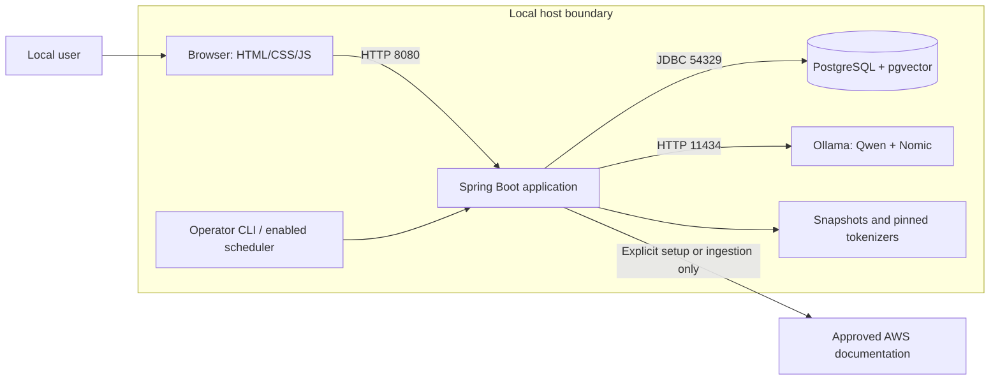
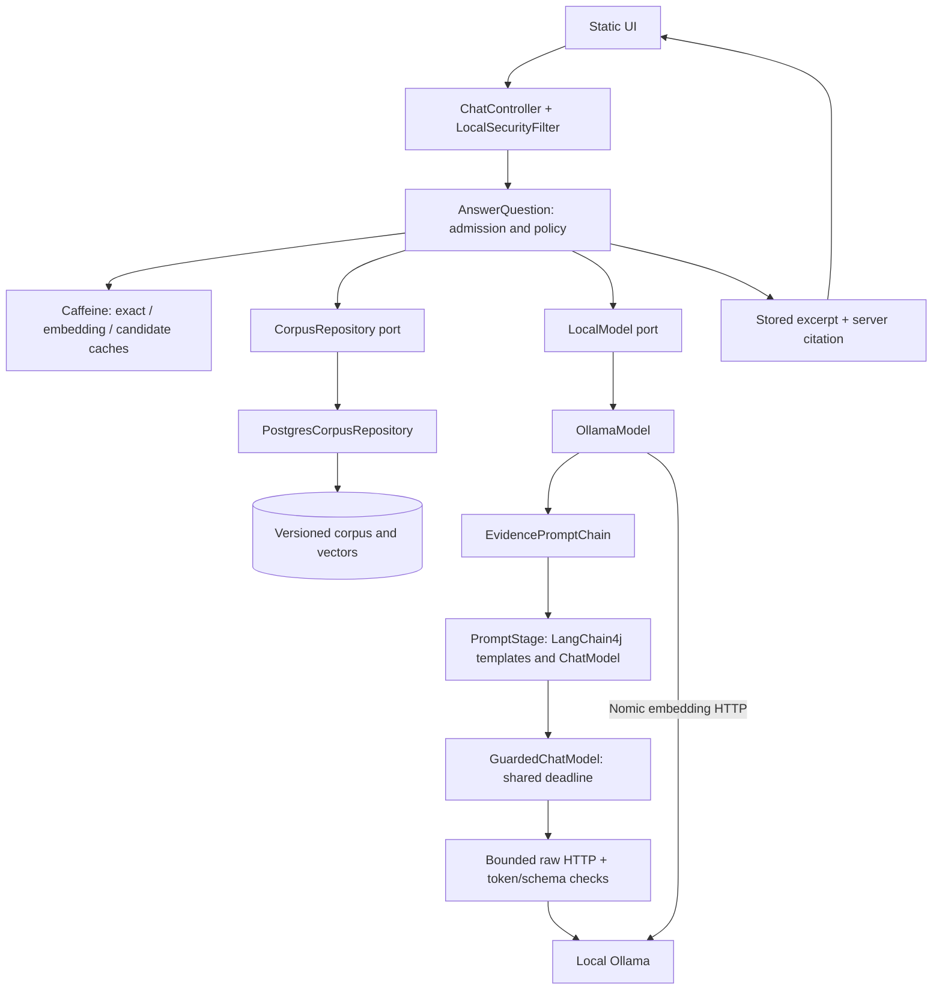
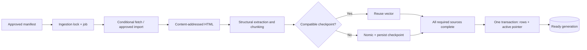

# High-level design: AWS Tech Support Agent

Baseline 0.3 · 2026-08-31 · User-authorized LangChain4j integration.

This document describes implemented boundaries. See [low-level design](low-level-design.md) for classes, sequences and storage; [requirements](requirements.md) for policy; and [verification status](implementation-status.md) for measured results and outstanding production gates.

## System context

The product is a portable local Java documentation assistant, not an AWS account operator. Java 21, a compatible Ollama runtime and PostgreSQL/pgvector define the runtime contract. Mac ARM64 with 16 GB RAM is the tested reference environment, not an architectural restriction. [Platform setup](platform-setup.md) distinguishes supported setup paths from unverified platforms.

All listeners bind to loopback. The browser never calls Ollama or PostgreSQL directly. Answering has no web search, AWS SDK/account access, tools, shell execution or cloud fallback. The database runs in the pinned Docker image or an independently provisioned native PostgreSQL instance. Ollama runs on the host; macOS uses native Metal acceleration.

## Application components

`GuardedChatModel` is an inner adapter in `OllamaModel`: it translates LangChain4j messages into the existing checked raw Ollama protocol. LangChain4j core 1.19.0 provides `PromptTemplate`, `ChatRequest`, `ChatModel` and schema types. AI Services proxies, automatic RAG, chat memory, agent loops, tools, output-repair retries and the stock Ollama provider client are **not** enabled.

| Package | Implemented responsibility |
| --- | --- |
| `domain` | `Types`, `Deadline`, `SupportException`: requests, evidence, provenance and policy identities |
| `ports` | `LocalModel`, `CorpusRepository`, `TokenCounter`, `DocumentSource`, `DocumentParser`, `WorkCoordinator` |
| `application` | `AnswerQuestion`, `IngestCorpus`, `DocumentChunker`, `Hashes` |
| `adapters.inbound` | REST, operator commands, scheduler, local security, errors and readiness |
| `adapters.outbound` | Prompt stages, guarded Ollama, JDBC, tokenizers, fetching/parsing and advisory locks |
| `bootstrap` | `RagProperties`; startup is `AwsSupportApplication.main()` |
| `resources/static` | UI, with no frontend runtime or CDN |
| `resources/prompts` | Reviewed packaged policies and evidence-data template |

Domain/ports remain framework-independent. LangChain4j stays in outbound adapters; application code owns the decision to accept, abstain, clarify, cache or render. Controllers construct neither prompts nor SQL.

## Answering policy

1. Validate and admit the request, pin a ready corpus generation, and check installed model digests.
2. Check the exact cache, scoped by question/history/filters, generation, policy epoch, models and prompt-content identity. Cache hits still recheck source validity.
3. Clarify explicit region/version filters; abstain for recognized live-state patterns. These are limited heuristics, not universal scope detection.
4. Obtain the prefixed question embedding from cache or Nomic.
5. Retrieve dense cosine and English lexical candidates, optionally restricted by reused candidate IDs; merge rankings with exact identifier matches.
6. Deduplicate text, apply the initial 0.40 cosine cutoff, and retain up to eight passages within token budgets.
7. LangChain4j selection chooses at most three aliases. Java validates membership, uniqueness and decision consistency.
8. LangChain4j coverage checks the original question against only those selected excerpts. Missing, unsupported or uncertain evidence causes abstention.
9. Java rechecks provenance/epoch, copies stored text, builds citations and caches only accepted answers.

A fresh successful request normally uses one Nomic inference and two Qwen inferences. Embedding-cache hits skip Nomic; exact-answer hits skip all inference. If reused retrieval candidates fail, a single full-retrieval fallback may repeat selection/coverage, up to four Qwen calls under the same 60-second deadline. No framework retry adds calls.

The second Qwen pass is not an independent truth oracle. Strict excerpts prevent newly generated factual sentences, but do not prove relevance, completeness, freshness or source authenticity. Synthesized prose remains disabled.

## Ingestion and publication

Downloads and inference occur outside publication transactions. Fetching is sequential and embeddings are generated one input at a time. Jobs and checkpoints are durable; documents/chunks are staged in Java before publication. There is no persisted `BUILDING` generation or separate evidence-span table: a complete chunk is the cited span. Identical fingerprints retain the generation; failures retain the previous corpus and completed checkpoints.

Daily refresh is opt-in while the process runs, with a persisted 15-minute failure backoff. PostgreSQL session advisory locks coordinate processes; they are not expiring distributed leases with fencing tokens. Strict chat-priority scheduling and automatic retention pruning are not implemented. See [data lifecycle](data-lifecycle.md).

## Resource and trust boundaries

The initial profile uses a 512 MiB JVM heap, 128 MiB accounted cache-entry budget, eight JDBC connections, five admitted requests per JVM, and one application-coordinated inference at a time. Qwen context is 8,192 tokens with at most 4,500 evidence and 800 output tokens; the final prompt check reserves another 128 tokens. These are settings, not proven cross-platform SLOs.

Durable model health is marked in-progress before inference. Uncertain completion, timeout or process death leaves it quarantined until operator recovery. Direct terminal Ollama clients bypass the application lock; avoid concurrent use during app operation/evaluation.

Host/Origin/CSRF controls, CSP, size limits, approved ingestion sources, pinned profiles and parameterized SQL reduce risk. This profile does not provide company identity, tenant isolation, TLS, least-privilege database roles, HA or a completed security audit.

## Extension and distributed deployment

Add explicit prompt stages using the [extension guide](prompt-chains.md). New stages must share deadlines and preserve validation gates. Model outputs cannot choose tools, sources or the next operation.

Separating ingestion/serving, distributed admission, external caches/invalidation, managed databases, identity and tenant scope require additional design and evaluation. LangChain4j does not provide those automatically. Keep replaceable ports and immutable generations, and measure contention before splitting the modular monolith.
