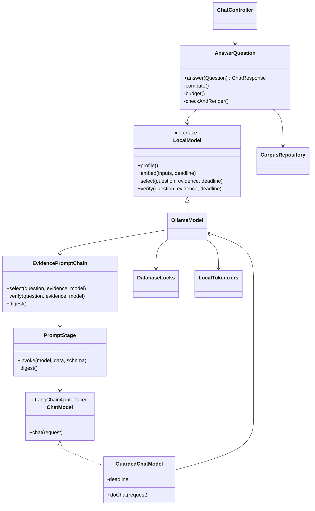
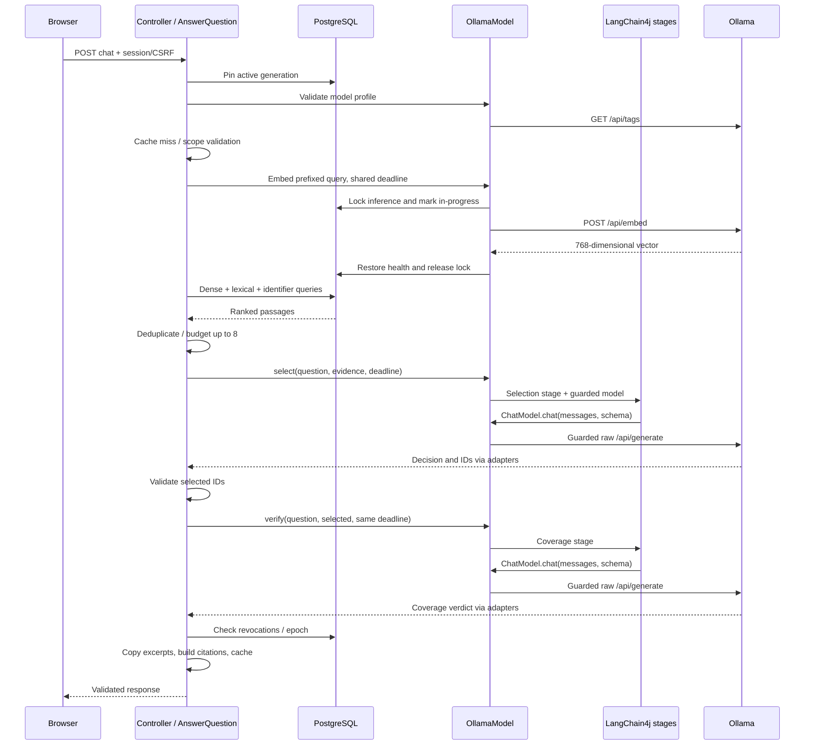
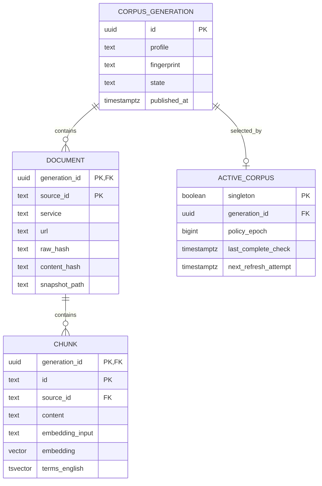

# Low-level design

Baseline 0.3 · 2026-08-31. Companion to [high-level design](design.md).

## Entry points and classes

`AwsSupportApplication.main()` starts Spring. `POST /api/v1/chat` invokes `ChatController.chat()` then `AnswerQuestion.answer()`. Operator commands use the same bootstrap in non-web mode.

`GuardedChatModel` is a private request-scoped inner class, not a singleton with mutable request state. It closes over the original `Deadline`. Requests require one system message, one text-only user message, a raw JSON schema and no tools. Unsupported shapes fail visibly.

## Successful uncached request

Both generation calls also acquire the inference lock and transition model health. Repeated lock details are omitted above for readability. No transaction spans an inference call.

## Branch and failure rules

- A valid exact answer-cache hit bypasses inference/retrieval but still checks profile and source state.
- Unsupported explicit region/version scope clarifies; recognized live-state patterns abstain.
- No budgeted evidence means no Qwen call. Selection abstention/clarification means no coverage call.
- Failed reuse of retrieval candidates permits one full retrieval retry; that retry cannot recurse. The original deadline remains in force.
- Invalid output yields abstention; operational failures yield typed errors. Unknown inference completion quarantines the runtime instead of retrying.
- Only accepted stored excerpts can be rendered/cached. A subsequent stage cannot make rejected evidence valid without the same deterministic gates.

| Boundary | Contract |
| --- | --- |
| Selection | ANSWERABLE/UNAVAILABLE/CLARIFY and at most 3 unique aliases from supplied E1..E8 |
| Java selection gate | ANSWERABLE requires 1–3 unique known IDs; server resolves actual chunk IDs |
| Coverage | Only a single SUPPORTED verdict succeeds; unsupported/uncertain/extra fields fail |
| Qwen request | Raw ChatML, no unchecked streaming, JSON schema, context 8192, output cap 800, seed 42, temperature 0.1 |
| Validation | Completed, not length-terminated; object JSON with no trailing tokens; local/runtime prompt counts agree within 2 tokens |
| Rendering | Claim text copied from selected chunk; citation URL, quote and generation built by Java |

## Templates and profiles

`EvidencePromptChain` loads the selection and coverage policies plus `evidence-user.txt` from `resources/prompts`. The latter substitutes `{{data}}` once with canonical JSON containing the question/history/filters and evidence aliases/service/title/heading/text. It never receives vectors. Template-like input stays literal data.

`PromptStage` builds LangChain4j messages and the constrained `ChatRequest`. `GuardedChatModel` translates these to the existing raw formatter. Data angle brackets are escaped so they cannot close ChatML role delimiters. This is one injection defense, not proof of semantic safety.

`ModelProfile.embeddingProfile()` remains unchanged. `answerProfile()` includes generator identity, `extractive-v5:retrieval-v2` and the ordered stage/template digest. A prompt-only change therefore invalidates answer reuse without rebuilding embeddings. Each future stage must join the digest and preserve explicit bounds; see [prompt-chains.md](prompt-chains.md).

## Cache and concurrency

| Cache | Accounted entry weight | TTL | Contents |
| --- | ---: | --- | --- |
| Exact answer | 64 MiB | 30 minutes | Accepted answer + source IDs |
| Query embedding | 16 MiB | 24 hours | Vector keyed by exact input and embedding profile |
| Retrieval | 16 MiB | 15 minutes | Candidate IDs for a scoped request |
| Similar-query candidates | 32 MiB; max 2000 entries | 10 minutes | Scoped vector + candidate IDs, never another query's answer |

Caches and request coalescing are process-local. Generation, epoch, policy/prompt identity, filters and history scope exact answers. Five admission slots include coalesced waiters. Advisory locks coordinate ingestion and inference across processes sharing the database, but do not provide distributed admission or strict request priorities.

## Database relationships

Selected fields are shown; Flyway migrations are authoritative. A chunk is the cited span, with no separate offsets table. Supporting tables: `embedding_checkpoint`, `ingestion_job`, `source_check`, `revoked_source`, `model_health`, and Flyway history.

Retrieval uses exact vector distance, not HNSW. It combines top 40 cosine matches, top 40 English disjunctive full-text matches, and up to 10 hits per eligible exact identifier. Generic acronyms such as AWS/IAM do not get identifier boosts. Fusion adds `1/(61+rankIndex)` per list, then uses stable ID tie-breaking. The returned similarity field remains cosine similarity, not the fused score or a correctness probability.

## Publication

`IngestCorpus.run()` holds the ingestion session lock while fetching, extracting, chunking and checkpointing. `publish()` then locks the active-pointer row, compares fingerprints and inserts the generation/documents/chunks plus active pointer in one transaction. A failed insert rolls everything back. Prompt changes do not require schema migrations or corpus publication.

See [data lifecycle](data-lifecycle.md), [operations](operations.md) and [acceptance criteria](acceptance.md) for changes, recovery and testing.
